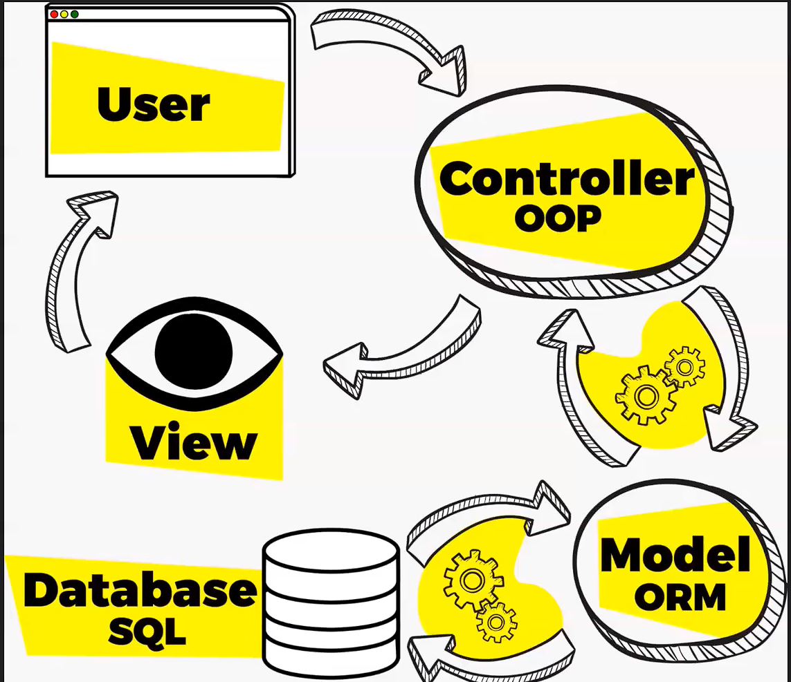

# World Wide Web
- Storia
    - Arpanenet 1969
    - Inizio Anni 90
        - Cern di Ginevra
        - Definizione del protocollo HTTP
        - Primo browser: Mosaic
        - Risorse organizzate in pagine
        - Primo sito Web: https://info.cern.ch/hypertext/WWW/TheProject.html
    - Come funziona internet?
        - Architettura client/server - routing

    
    - HTTP e come funziona
        - HTTP (HyperText Transfer Protocol)
        - Stateless
        - Richiesta
            - Metodi : GET,POST,...
            - URL (Uniform Resource Locator) e URI (Uniform Resource Identifier)
        - Response :  https://developer.mozilla.org/en-US/docs/Web/HTTP/Status
    - IP
    - DNS (Domain Name System)

    

    # Laravel

    - Cos'è un Framework?
    - Cos'è un composer e cos'è un dependency manager?
    - Come si crea un progetto Laravel
    - Quali sono gli elementi principali di un progetto Laravel ( Cartelle e File Importanti)
    - Documentazione di Laravel
        - Requisiti
        - Installazione
    - Laravel Framework MVC

    
    
    # Rotte e Viste

    - Introduzione a rotte e viste
    - Visualizzare un sito nel browser
        - php artisan serve
    - Esempi di rotte ( Live Coding )
