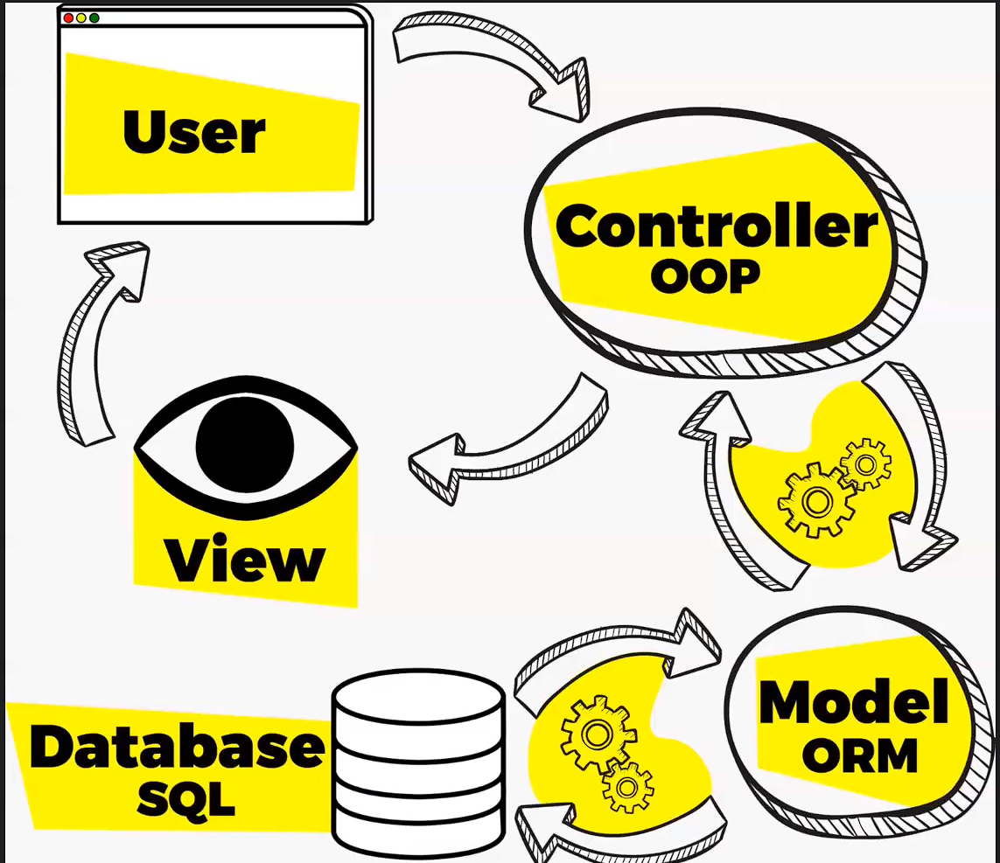

# Laravel - Lezione 3

- Helpers
    - config()
    - env()
    - {{ }} vs {!! !!}

# MVC

- MVC: Model View Controller
- 
    
- SOC: Separion of Concerns
- Controller
    - Come si crea un controller?
        - php artisan make:controller NomeDelController

